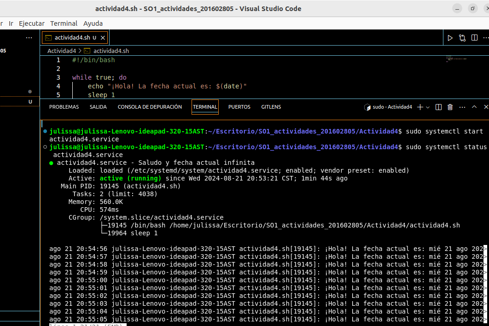

### Paso 1: Crear un script, el nombre es actividad4.sh
```
#!/bin/bash
while true; do
    echo "¡Hola! La fecha actual es: $(date)"
    sleep 1
done
```

### Paso 2: Guardamos nuestro archivo creado
```
sudo chmod +x /home/julissa/Escritorio/SO1_actividades_201602805/Actividad4/actividad4.sh
```

### Paso 3: Debemos crear un archivo de unidad de servicio de systemd
```
sudo nano /etc/systemd/system/actividad4.service
```

### Paso 4: En el archivo de unidad de servicio debemos colocar lo siguiente, luego Ctrl+O para guardar y Ctrl+X para cerrar después de haber guardado el contenido del archivo.
```
[Unit]
Description=Saludo y fecha actual infinita

[Service]
ExecStart=/home/julissa/Escritorio/SO1_actividades_201602805/Actividad4/actividad4.sh
Restart=always
User=nobody
StandardOutput=journal

[Install]
WantedBy=multi-user.target
```

### Paso 5: Ahora debemos recargar la configuración para que systemd reconozca el nuevo servicio
```
sudo systemctl daemon-reload
```

### Paso 6: Habilitamos el servicio para que inicie con el sistema
```
sudo systemctl enable actividad4.service
```

### Paso 7: Verificar que el servicio está corriendo correctamente
```
sudo systemctl status saludo.service
```

### Paso 4: Verificar los logs generados por el servicio
```
sudo journalctl -u saludo.service
```
### Resultados

