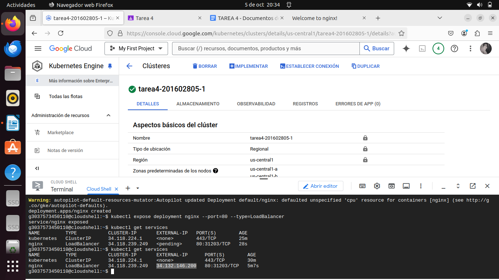
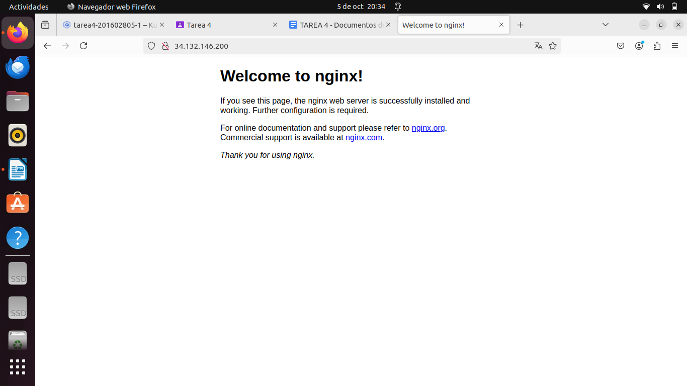

### Instalar un ambiente local de Kubernetes utlizando minikube, kind o Docker Desktop.
**Pasos:**
* Descargar Docker Desktop
* Abrir Docker Desktop
* Ir a la pestaña de Configuración y seleccionar Kubernetes.
* Marcar la casilla que dice Enable Kubernetes y hacer clic en Apply & Restart.
  


### Desplegar un contenedor de algun web server, apache o nginx por ejemplo, en el Cluster de K8s Local.
**Pasos:**
* Crear un objeto Deployment en Kubernetes
  ```
  kubectl create deployment nginx --image=nginx
  ```
* Verificar que el Deployment se haya creado correctamente y que el pod de Nginx esté corriendo
  ```
  kubectl get deployments
  kubectl get pods
  ```
* Exponer el servicio de Nginx
  ```
  kubectl expose deployment nginx --type=NodePort --port=800
  ```
* Obtener la URL de acceso
  ```
  kubectl get svc nginx
  ```
* Acceder a la URL proporcionada
  ```
  http://34.132.146.200
  ```


### Contestar a siguiente pregunta.¿En un ambiente local de Kubernetes existen los nodos masters y workers, como es que esto funciona?
En un entorno local de Kubernetes, se manejan nodos maestros (masters) y nodos de trabajo (workers). Los *nodos maestros* se encargan de la administración y control del clúster, gestionando la planificación de tareas, la supervisión del estado del sistema y la distribución de cargas de trabajo. Mientras tanto, los *nodos de trabajo* son los que ejecutan las aplicaciones o contenedores reales, recibiendo instrucciones del nodo maestro para desplegar y gestionar los recursos.
